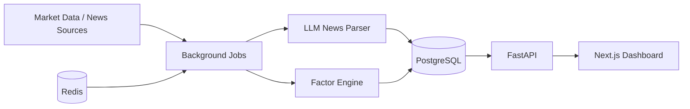

# Architecture

## System Overview

## Components

### Frontend

- Next.js app router
- React server components for API-backed dashboard data
- Client component for lightweight-charts
- Reads API through `NEXT_PUBLIC_API_BASE_URL`

### Backend

- FastAPI service under `/api`
- Pydantic schemas as API contracts
- Route modules under `backend/app/api/`
- Pydantic schemas under `backend/app/schemas/`
- Scoring modules under `backend/app/services/scoring/`
- Indicator modules under `backend/app/services/indicators/`
- Backtest Lab under `backend/app/services/backtest_lab.py`
- Probability Calibration under `backend/app/services/probability_calibration.py`
- Market Regime Engine under `backend/app/services/market_regime_engine.py`
- Signal Selection Layer under `backend/app/services/signal_selection_layer.py`
- Portfolio Risk Engine under `backend/app/services/portfolio_risk_engine.py`
- Provider interfaces under `backend/app/services/data_providers/`
- pytest contract tests

### API Surface

The MVP API uses mock/sample data until licensed market providers are connected.

- `GET /api/stocks`
- `GET /api/stocks/{stock_id}`
- `GET /api/stocks/{stock_id}/scores`
- `GET /api/stocks/{stock_id}/technical`
- `GET /api/stocks/{stock_id}/institutional`
- `GET /api/stocks/{stock_id}/news`
- `GET /api/rankings/top-probability`
- `GET /api/rankings/institutional-buying`
- `GET /api/rankings/macd-golden-cross`
- `GET /api/rankings/volume-price-divergence`
- `GET /api/us-market/radar`
- `GET /api/risk/high-risk`

All scoring endpoints return explainable research payloads and the standard disclaimer. They must not return direct investment advice.

### Database

- PostgreSQL
- Seed schema in `infra/postgres/init.sql`
- Tables for instruments, daily prices, news events, market sessions, and prediction signals

### Cache / Queue

- Redis is included for cache and queue-ready architecture
- APScheduler is used for the first scheduling skeleton
- Celery is included so high-volume ingestion can move to queue workers later

### Background Jobs

- `tw-after-close`: after Taiwan market close, processes daily Taiwan data
- `us-premarket-linkage`: before US open, computes US linkage signals
- `news-event-parser`: normalizes news into structured impact signals

Implemented MVP job behavior uses mock providers first:

- `daily_after_market_job` updates mock Taiwan prices, institutional/chip data, technical indicators, and final factor score artifacts.
- `pre_open_us_market_job` updates mock US market linkage data, calculates per-stock USMarketScore, and generates a pre-open radar ranking.
- `news_ingestion_job` ingests mock provider news, classifies events through the parser interface, and calculates NewsScore payloads.

The jobs currently return write-ready artifacts instead of persisting to PostgreSQL directly. The next provider/database phase should replace the mock provider with licensed data sources and write these artifacts into the schema tables.

### Backtest Lab

Backtesting is intentionally separate from the live scoring modules. The lab consumes point-in-time signal observations, applies an explicit configuration, and reports research metrics without changing model logic.

Supported MVP controls:

- holding period
- entry probability threshold
- transaction cost and slippage
- take-profit and stop-loss exits
- market state, sector, market-cap, and liquidity filters
- chronological time-series split windows

Required result metrics include win rate, trade count, average and median return, expectancy, max drawdown, Profit Factor, Sharpe Ratio, Sortino Ratio, max single loss, max consecutive losses, average holding days, turnover, sector win rate, and market-state win rate.

Backtests must use features and labels that were available at the signal timestamp. Do not use revised fundamentals, later-published labels, or future market data when simulating historical signals.

### Probability Calibration

Probability calibration is independent from the scoring formula. It compares historical predicted probabilities with realized labels and reports whether the displayed probability is trustworthy.

Supported MVP outputs:

- Calibration Curve buckets such as 60%-65%, 65%-70%, and 70%-75%
- Brier Score for probability accuracy
- Probability Bucket Backtest with sample count, average predicted probability, actual win rate, calibration error, and reliability status
- segment filters for horizon, sector, and market state

If a bucket predicts 80% but the realized win rate is near 55%, the bucket should be marked overconfident and reviewed before showing high-confidence language in the UI.

### Market Regime Engine

The market regime engine classifies the current environment and emits dynamic factor-weight guidance. It is separate from the raw scoring modules so the app can change factor emphasis without rewriting each factor.

MVP regimes:

- bull market
- bear market
- range market
- high-volatility market
- low-volatility market
- foreign inflow and foreign outflow
- US technology strength and weakness

Examples:

- bull markets increase technical breakout, institutional flow, and fundamental momentum weights
- bear markets increase the RiskScore multiplier and reduce trend-following confidence
- range markets emphasize technical structure, volume-price divergence, and support/resistance context
- US technology strength increases USMarketScore sensitivity for semiconductor and electronics supply-chain names

### Signal Selection Layer

The signal selection layer runs after probability scoring, calibration, risk scoring, and regime analysis. Its job is to decide whether a signal should be shown as a primary research candidate, downgraded, marked high risk, or excluded.

Selection checks:

- probability threshold
- RiskScore threshold
- calibration sample count
- model confidence
- liquidity score
- major negative news or material event flags
- high-risk event windows such as earnings, conference calls, and ex-dividend periods
- factor conflict checks such as positive US linkage but weak Taiwan institutional/chip score

The layer intentionally supports a no-signal decision. The system should prefer fewer, higher-confidence research signals over broad daily lists.

### Portfolio Risk Engine

The portfolio risk engine turns selected research signals into a simulated risk-aware watchlist. It does not place orders or provide personalized portfolio advice.

MVP controls:

- single-stock maximum weight
- sector maximum weight
- maximum holding count
- maximum new signals per day
- drawdown and volatility deleveraging
- consecutive-loss deleveraging
- high-VIX exposure reduction
- weak US futures electronics exposure reduction

Example: if 30 high-scoring names are all in AI server supply chains, the engine caps sector exposure and keeps only the highest-ranked subset instead of allowing the watchlist to become one concentrated theme.

## Runtime

Local development is Docker Compose:

- `postgres`
- `redis`
- `api`
- `worker`
- `frontend`

## Data Flow

1. Jobs ingest market and news inputs.
2. Parser and factor engine normalize raw data.
3. Prediction signals are stored in PostgreSQL.
4. FastAPI exposes signals and market summaries.
5. Next.js dashboard renders signals and charts.

## Deployment Notes

Phase 1 can deploy frontend and API separately. Keep the API stateless. Background jobs need a runtime that supports scheduled workers.

For production, choose managed PostgreSQL and Redis, and make sure data-source licenses allow the intended use.
