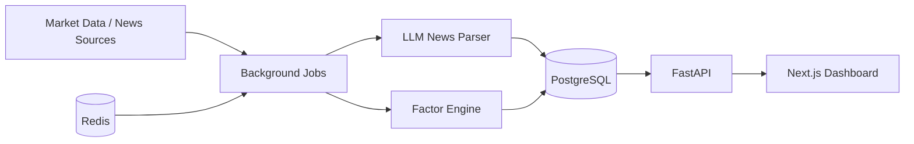

# Architecture

## System Overview

## Components

### Frontend

- Next.js app router
- React server components for API-backed dashboard data
- Client component for lightweight-charts
- Reads API through `NEXT_PUBLIC_API_BASE_URL`

### Backend

- FastAPI service under `/api`
- Pydantic schemas as API contracts
- Service layer for market summary, prediction signals, and news parsing
- pytest contract tests

### Database

- PostgreSQL
- Seed schema in `infra/postgres/init.sql`
- Tables for instruments, daily prices, news events, market sessions, and prediction signals

### Cache / Queue

- Redis is included for cache and queue-ready architecture
- APScheduler is used for the first scheduling skeleton
- Celery is included so high-volume ingestion can move to queue workers later

### Background Jobs

- `tw-after-close`: after Taiwan market close, processes daily Taiwan data
- `us-premarket-linkage`: before US open, computes US linkage signals
- `news-event-parser`: normalizes news into structured impact signals

## Runtime

Local development is Docker Compose:

- `postgres`
- `redis`
- `api`
- `worker`
- `frontend`

## Data Flow

1. Jobs ingest market and news inputs.
2. Parser and factor engine normalize raw data.
3. Prediction signals are stored in PostgreSQL.
4. FastAPI exposes signals and market summaries.
5. Next.js dashboard renders signals and charts.

## Deployment Notes

Phase 1 can deploy frontend and API separately. Keep the API stateless. Background jobs need a runtime that supports scheduled workers.

For production, choose managed PostgreSQL and Redis, and make sure data-source licenses allow the intended use.
